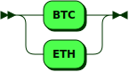

**Intentions:**


```
Intentions
         ::= User Ordering
           | Auto ( Invoicing | Delivering | Confirming ) '.'
```

**Auto:**


```
Auto     ::= 'We are '
```

referenced by:

* Intentions

**Invoicing:**


```
Invoicing
         ::= ( Buying | Selling ) Delivery Signature
```

referenced by:

* Intentions

**Buying:**


```
Buying   ::= 'buying ' Asset ' in order for ' Cash
```

referenced by:

* Invoicing

**Selling:**


```
Selling  ::= 'selling ' Asset ' in order for ' Cash
```

referenced by:

* Invoicing

**Delivery:**


```
Delivery ::= ' and delivery is good until the market volume reaches ' ExactAmount
```

referenced by:

* Invoicing

**Signature:**


```
Signature
         ::= ' using the signature ' AlphaNumeric
```

referenced by:

* Invoicing

**Asset:**


```
Asset    ::= ExactAmount ' using ' AssetAddress
```

referenced by:

* Buying
* Selling

**Cash:**


```
Cash     ::= ExactAmount ' using ' CashAddress
```

referenced by:

* Buying
* Selling

**ExactAmount:**


```
ExactAmount
         ::= ' exactly ' Numeric Units
```

referenced by:

* Asset
* Cash
* Delivery

**AssetAddress:**


```
AssetAddress
         ::= ' the ' AssetUnits ' address ' AlphaNumeric
```

referenced by:

* Asset

**CashAddress:**


```
CashAddress
         ::= ' the SWOBL address ' AlphaNumeric
```

referenced by:

* Cash

**AssetUnits:**



```
AssetUnits
         ::= 'BTC'
           | 'ETH'
```

referenced by:

* AssetAddress

## 
 <sup>generated by [RR - Railroad Diagram Generator][RR]</sup>

[RR]: http://bottlecaps.de/rr/ui