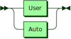
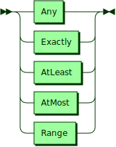
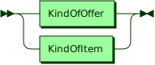

**Intentions:**


```
Intentions
         ::= Transacting '.' EndOfLine
```

**Transacting:**


```
Transacting
         ::= Actors Actions Signature
```

referenced by:

* Intentions

**Actors:**



```
Actors   ::= User
           | Auto
```

referenced by:

* Transacting

**Actions:**


```
Actions  ::= Ordering
           | Invoicing
           | Delivering
           | Confirming
```

referenced by:

* Transacting

**Signature:**


```
Signature
         ::= ' commiting by signature ' AlfaNumeric
```

referenced by:

* Transacting

**User:**


```
User     ::= 'I am'
```

referenced by:

* Actors

**Auto:**


```
Auto     ::= 'We are'
```

referenced by:

* Actors

**Ordering:**


```
Ordering ::= ( Bidding | Asking ) Reservation
```

referenced by:

* Actions

**Invoicing:**


```
Invoicing
         ::= ( Buying | Selling ) Expiration
```

referenced by:

* Actions

**Delivering:**


```
Delivering
         ::= ( Paying | Cashing ) Execution
```

referenced by:

* Actions

**Confirming:**


```
Confirming
         ::= ( Expensing | Receipting ) Confirmation
```

referenced by:

* Actions

**Bidding:**


```
Bidding  ::= ' bidding' Offer ' with reservation to buy in' MarketItem
```

referenced by:

* Ordering

**Asking:**


```
Asking   ::= ' asking' MarketOffer ' with reservation to sell out' Item
```

referenced by:

* Ordering

**Reservation:**


```
Reservation
         ::= ' and the order is good when the market volume reaches' Volume
```

referenced by:

* Ordering

**Buying:**


```
Buying   ::= ' buying' Item ' with expiration to pay out' Offer
```

referenced by:

* Invoicing

**Selling:**


```
Selling  ::= ' selling' Item ' with expiration to cash in' Offer
```

referenced by:

* Invoicing

**Expiration:**


```
Expiration
         ::= ' and the invoice is good when the market volume reaches' Volume
```

referenced by:

* Invoicing

**Paying:**


```
Paying   ::= ' paying' Offer ' with execution to receipt in' Item
```

referenced by:

* Delivering

**Cashing:**


```
Cashing  ::= ' cashing' Item ' with execution to expense out' Offer
```

referenced by:

* Delivering

**Execution:**


```
Execution
         ::= ' and the delivery is good when the market volume reaches' Volume
```

referenced by:

* Delivering

**Expensing:**


```
Expensing
         ::= ' expensing' Offer ' with confirmation of receipt of' Item
```

referenced by:

* Confirming

**Receipting:**


```
Receipting
         ::= ' receipting' Item ' with confirmation of expense of' Offer
```

referenced by:

* Confirming

**Confirmation:**


```
Confirmation
         ::= ' and the confirmation is good at the market' MarketVolume ', ' MarketAccount ' and' MarketInventory
```

referenced by:

* Confirming

**MarketVolume:**


```
MarketVolume
         ::= ' volume of' Exactly ' SWOBL'
```

referenced by:

* Confirmation

**MarketAccount:**


```
MarketAccount
         ::= ' account of' Exactly ' SWOBL'
```

referenced by:

* Confirmation

**MarketInventory:**


```
MarketInventory
         ::= ' inventory of' Exactly KindOfItem
```

referenced by:

* Confirmation

**Offer:**


```
Offer    ::= Amounts KindOfOffer Address
```

referenced by:

* Bidding
* Buying
* Cashing
* Expensing
* Paying
* Receipting
* Selling

**MarketOffer:**


```
MarketOffer
         ::= Amounts KindOfOffer ' from the market'
```

referenced by:

* Asking

**Item:**


```
Item     ::= Amounts KindOfItem Address
```

referenced by:

* Asking
* Buying
* Cashing
* Expensing
* Paying
* Receipting
* Selling

**MarketItem:**


```
MarketItem
         ::= Amounts KindOfItem ' from the market'
```

referenced by:

* Bidding

**Amounts:**



```
Amounts  ::= Any
           | Exactly
           | AtLeast
           | AtMost
           | Range
```

referenced by:

* Item
* MarketItem
* MarketOffer
* Offer

**KindOf:**



```
KindOf   ::= KindOfOffer
           | KindOfItem
```

**KindOfOffer:**


```
KindOfOffer
         ::= ' SWOBL'
```

referenced by:

* KindOf
* MarketOffer
* Offer

**KindOfItem:**


```
KindOfItem
         ::= ' BTC'
           | ' ETH'
```

referenced by:

* Item
* KindOf
* MarketInventory
* MarketItem

**Address:**


```
Address  ::= ' from the address ' AlfaNumeric
```

referenced by:

* Item
* Offer

**Any:**


```
Any      ::= ' any amount of'
```

referenced by:

* Amounts

**Exactly:**


```
Exactly  ::= ' exactly ' Number
```

referenced by:

* Amounts
* MarketAccount
* MarketInventory
* MarketVolume

**AtLeast:**


```
AtLeast  ::= ' at least ' Number
```

referenced by:

* Amounts

**AtMost:**


```
AtMost   ::= ' at most ' Number
```

referenced by:

* Amounts

**Range:**


```
Range    ::= ' at least ' Number ' and at most ' Number
```

referenced by:

* Amounts

## 
 <sup>generated by [RR - Railroad Diagram Generator][RR]</sup>

[RR]: http://bottlecaps.de/rr/ui
