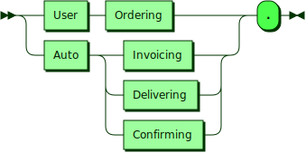
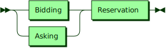
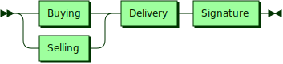
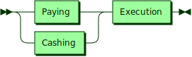
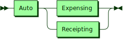

# Swopblock Action Grammar [DRAFT 03/06/23]

The Swopblock action grammar is a grammar for messages that specify four kinds of actions each in a complete English sentence that are used together to specify a complete Swopblock transaction. The four types of actions are Ordering, Invoicing, Delivering and Confirming. These actions are intentions on the part of a user in the case of Ordering and are autonomous in the case of Invoicing, Delivering and Confirming. 

**Intentions:**

** **

# Order Grammar

The Swopblock ordering grammar is the grammar for a message that specifies an order made by a user that contains an offer and an order. There are two kinds of orders: bidding and asking.

**Ordering:**

** **

# Invoice Grammar

The Swopblock invoicing grammar is the grammar for a kind of message that specifies an order made autonomously that matches offers to orders. There are two kinds of invoices: buying and selling.

**Invoicing:**

** **

# Delivery Grammar

The Swopblock changing grammar is the grammar for a kind of message that specifies a change made autonomously that fulfills invoice offers and orders. There are two kinds of deliveries: paying and cashing.

**Delivering:**

** **

# Confirmation Grammar

The Swopblock confirming grammar is the grammar for a kind of message that specifies a confirmation made autonomously that confirms a paying or cashing change that finalizes a Swopblock transaction. There are two kinds of confirmations: expense and receipt.

**Confirming:**

## 
 generated by [RR - Railroad Diagram Generator][RR]

[RR]: http://bottlecaps.de/rr/ui
