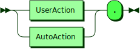
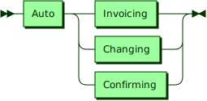
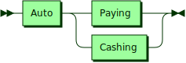

# Swopblock Action Grammar [DRAFT 02/24/23]

The Swopblock action grammar is a grammar for messages that specify four kinds of actions each in a complete English sentence that are used together to specify a complete Swopblock transaction. The four types of actions are Ordering, Invoicing, Changing and Confirming. These actions are actions on the part of a user in the case of Ordering and are autonomous in the case of Invoicing, Changing and Confirming. The figures in this document are renderings based on EBNF notation grammar production rules with the literal production shown in round rectangles. (Note: this document specifies only a sub set of the eventual grammar required for expirations, cancellations, limit orders and other features of the Swopblock protocol.)


**Actions:**



```
Actions  ::= ( UserAction | AutoAction ) '.'
```

**UserAction:**


```
UserAction
         ::= User Ordering
```

referenced by:

* Actions

**AutoAction:**



```
AutoAction
         ::= Auto ( Invoicing | Changing | Confirming )
```

referenced by:

* Actions

**User:**


```
User     ::= 'I am '
```

referenced by:

* Ordering
* UserAction

**Auto:**


```
Auto     ::= 'We are '
```

referenced by:

* AutoAction
* Changing
* Confirming
* Invoicing

# Swopblock Ordering Grammar

The Swopblock ordering grammar is the grammar for a message that specifies an order made by a user that contains an offer and an order. There are two kinds of orders: orders that specify a bidding offer to buy an order and orders that specify an asking order to sell an offer.

**Ordering:**


```
Ordering ::= User ( Bidding | Asking )
```

referenced by:

* UserAction

**Bidding:**


```
Bidding  ::= 'bidding ' Offer 'in order for ' Order
```

referenced by:

* Ordering

**Asking:**


```
Asking   ::= 'asking ' Order 'in order for ' Offer
```

referenced by:

* Ordering
* 
**Offer:**


```
Offer    ::= Amount Unit 'using the ' Unit Address
```

**Order:**


```
Order    ::= Unit 'using the market'
```

**Unit:**


```
Unit     ::= 'BTC'
           | 'ETH'
           | 'SWOBL'
```

referenced by:

* Offer
* Order

**Expiration:**


```
Expiration
         ::= ' and is good until the SWOBL market volume reaches ' Amount
```

**Signature:**


```
Signature
         ::= ' using my signature ' SignatureBinary
```

**Amount:**


```
Amount   ::= ' at least ' Number ' and at most ' Number
```

referenced by:

* Expiration
* Offer

# Swopblock Invoicing Grammar

The Swopblock invoicing grammar is the grammar for a kind of message that specifies an order made autonomously that matches offers to orders. There are two kinds of invoices: invoices that buy an order in exchange for an offer made by a user in a bid and invoices that sell in exchange for an offer made by a user in an ask.

**Invoicing:**


```
Invoicing
         ::= Auto ( Buying | Selling )
```

referenced by:

* AutoAction

**Buying:**


```
Buying   ::= 'buying ' Offer 'and selling ' Offer
```

referenced by:

* Invoicing

**Selling:**


```
Selling  ::= 'selling ' Offer 'and buying ' Offer
```

referenced by:

* Invoicing

# Swopblock Changing Grammar

The Swopblock changing grammar is the grammar for a kind of message that specifies a change made autonomously that fulfills invoice offers and orders. There are two kinds of changes: changes that “pay cash” (deliver SWOBL) for an invoice and changes that “cash in” (deliver BTC, ETH, etc.) for an invoice.

**Changing:**



```
Changing ::= Auto ( Paying | Cashing )
```

referenced by:

* AutoAction

**Paying:**


```
Paying   ::= 'paying ' Cash 'on invoice for ' Asset
```

referenced by:

* Changing

**Cashing:**


```
Cashing  ::= 'cashing ' Asset 'on invoice for ' Cash
```

referenced by:

* Changing

**Cash:**


```
Cash     ::= Amount 'SWOBL using ' AssetUnit Address
```

referenced by:

* Cashing
* Expensing
* Paying

**Asset:**


```
Asset    ::= Amount AssetUnit 'using SWOBL ' Address
```

referenced by:

* Cashing
* Paying
* Receipting

# Swopblock Confirming Grammar

The Swopblock confirming grammar is the grammar for a kind of message that specifies a confirmation made autonomously that confirms a paying or cashing change that finalizes a Swopblock transaction. There are two kinds of confirmations: confirmations that confirm an expenditure (SWOBL delivery) and confirmations that confirm a receipt (BTC, ETH, etc. delivery).

**Confirming:**


```
Confirming
         ::= Auto ( Expensing | Receipting )
```

referenced by:

* AutoAction

**Expensing:**


```
Expensing
         ::= 'confirming expenditure of ' Cash
```

referenced by:

* Confirming

**Receipting:**


```
Receipting
         ::= 'confirming receipt of ' Asset
```

referenced by:

* Confirming

**Offer:**


```
Offer    ::= Amount Unit 'using the ' Unit Address
```

referenced by:

* Asking
* Bidding
* Buying
* Selling

**Order:**


```
Order    ::= Unit 'using the market'
```

referenced by:

* Asking
* Bidding

**Unit:**


```
Unit     ::= 'BTC'
           | 'ETH'
           | 'SWOBL'
```

referenced by:

* Offer
* Order

## 
 <sup>generated by [RR - Railroad Diagram Generator][RR]</sup>

[RR]: http://bottlecaps.de/rr/ui
