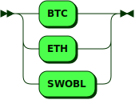

**Intentions:**


```
Intentions
         ::= User Ordering
           | Auto ( Invoicing | Changing | Confirming ) '.'
```

**User:**


```
User     ::= 'I am '
```

referenced by:

* Intentions

**Ordering:**


```
Ordering ::= ( Bidding | Asking ) Experiation Signature
```

referenced by:

* Intentions

**Bidding:**


```
Bidding  ::= 'bidding ' Offer ' in order for ' Order
```

referenced by:

* Ordering

**Asking:**


```
Asking   ::= 'asking ' Order ' in order for ' Offer
```

referenced by:

* Ordering

**Experiation:**


```
Experiation
         ::= ' and the order is good when the market volume reaches ' Amount
```

referenced by:

* Ordering

**Signature:**


```
Signature
         ::= ' using the signature ' AlphaNumeric
```

referenced by:

* Ordering

**Offer:**


```
Offer    ::= Amount ' using ' Address
```

referenced by:

* Asking
* Bidding

**Order:**


```
Order    ::= Amount ' using ' Market
```

referenced by:

* Asking
* Bidding

**Amount:**


```
Amount   ::= ' at least ' Numeric ' and at most ' Numeric Units
```

referenced by:

* Experiation
* Offer
* Order

**Address:**


```
Address  ::= ' the ' Units ' address ' AlphaNumeric
```

referenced by:

* Offer

**Market:**


```
Market   ::= ' the market '
```

referenced by:

* Order

**Units:**



```
Units    ::= 'BTC'
           | 'ETH'
           | 'SWOBL'
```

referenced by:

* Address
* Amount

## 
 <sup>generated by [RR - Railroad Diagram Generator][RR]</sup>

[RR]: http://bottlecaps.de/rr/ui